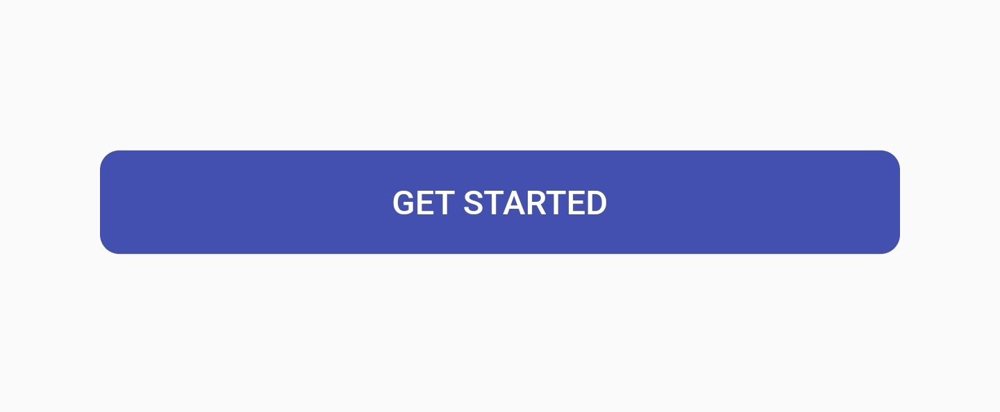
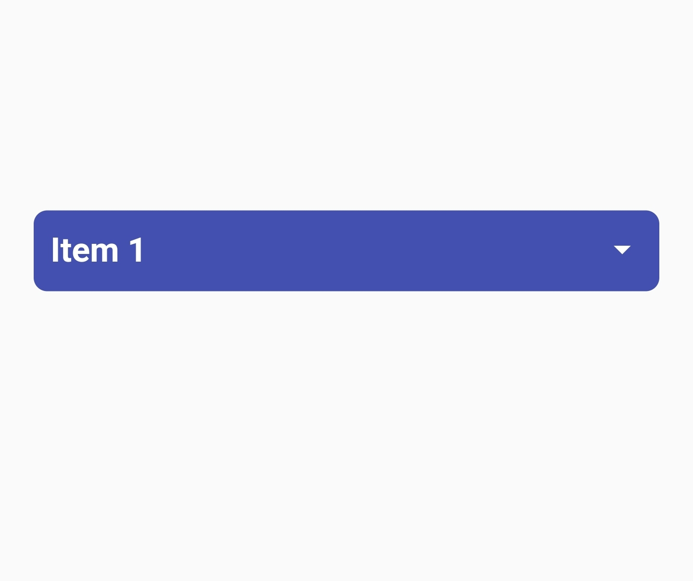
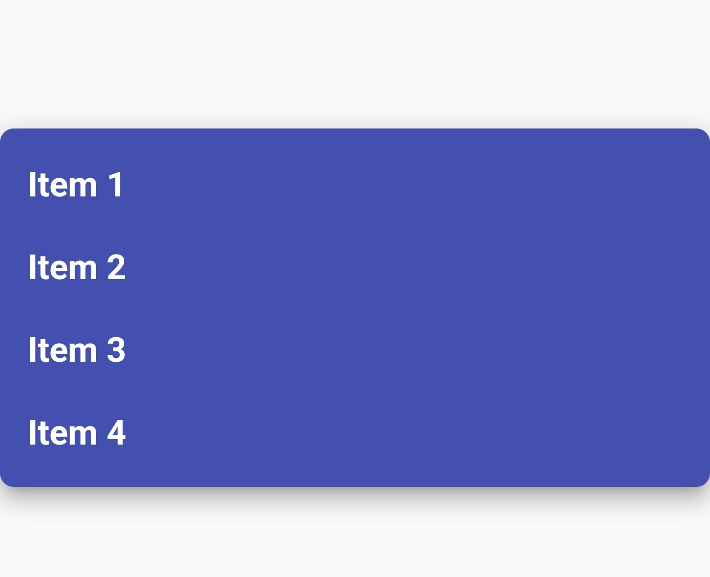

# ms_widgets

## Introduction:
- This Simple package help you to implement a lot of widgets with small code and with perfect style

## Features

- Package Widget:
  - defaultDropDownMenu
  - defaultImageButtonWithText  : Work with network image
  - defaultImageButtonWithText2  : Work with asset image
  - defaultButton
  - defaultTextFormField
  - defaultExpansionTile
  - defaultOnBoarding
  - defaultToast
  - defaultRating


## Getting started

- Add your package to your dependencies:

```bash
dependencies:
  ...
  ms_widgets: ^0.0.2
```

## Usage

### Let's Start With some samples:

- defaultButton
```dart
        defaultButton(
              backgroundColor: Colors.indigo,
              text: 'Get Started',
              borderRadius: BorderRadius.circular(8.0),
              isUpperCase: true,
              buttonHeight: MediaQuery.of(context).size.height * 0.05,
              buttonWidth: MediaQuery.of(context).size.width * 0.8,
              function: (){
              },
              textStyle: TextStyle(
                color: Colors.white,
              ),
            ),
```


- defaultOnBoarding
```dart
defaultOnBoarding(
            items: boarding,
            boardController: pageController,
            onPageChange: (int? index){

            },
            imageWidth: MediaQuery.of(context).size.width * 0.8,
            titleTextStyle: TextStyle(
              color: Colors.indigo,
              fontWeight: FontWeight.bold,
              fontSize: 20
            ),
            bodyTextStyle: TextStyle(
                color: Colors.indigo,
                fontWeight: FontWeight.bold,
                fontSize: 14
            ),
            spacing: 10,
          ),
```


- defaultExpansionTile

```dart
defaultExpansionTile(
            title: 'defaultExpansionTile',
            titleStyle: TextStyle(
              fontSize: 16,
              fontWeight: FontWeight.bold
            ),
            collapsedTextColor: Colors.white,
            collapsedIconColor: Colors.white,
            collapsedBackgroundColor: Colors.indigo,
            unCollapsedBackgroundColor: Colors.indigo,
            unCollapsedTextColor: Colors.white,
            unCollapsedIconColor: Colors.white,
            elevation: 5,
            children: [
              Container(
                height: 100,
              )
            ],
            borderRadius: BorderRadius.circular(8.0),
          ),
```
| Collapsed | unCollapsed |
| :---------------: | :------------: |
|  |  |
- defaultDropDownMenu

```dart
defaultDropDownMenu(
              items: items,
              selectedItem: selectItem,
              borderRadius: BorderRadius.circular(8.0),
              backgroundColor: Colors.indigo,
              dropDownColor: Colors.indigo,
              contentPadding: EdgeInsets.all(10),
              onChanged: (item){
                selectItem = item;
              },
              icon: Icon(
                Icons.arrow_drop_down,
                color: Colors.white,
              ),
            ),
```

| Collapsed | unCollapsed |
| :---------------: | :------------: |
|  |  |
- defaultDropDownMenu
 - defaultImageButtonWithText2
```dart
defaultImageButtonWithText2(
              imagePath: 'assets/images/apple.png',
              text: 'Apple',
              backgroundColor: Colors.grey[200],
              borderRadius: BorderRadius.circular(10),
              height: 80,
              width: 80,
              onPressed: (){},
              textStyle: TextStyle(
                color: Colors.black
              ),
            )
```
-defaultRating

```dart
 defaultRate(
        color: Colors.orange, //Start color
        iconSize: 80,  //Start size
        initialValue: 3.5,
        readOnly: false,
        onChange: (rating){     //rating is the rating value
        print(index);
        },
        allowClear: true,
        allowHalf: true,   //To handle that you can use half start (as a double rating not int)
)
```


